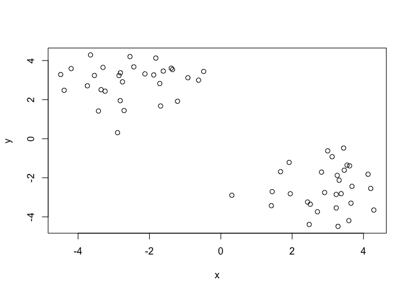
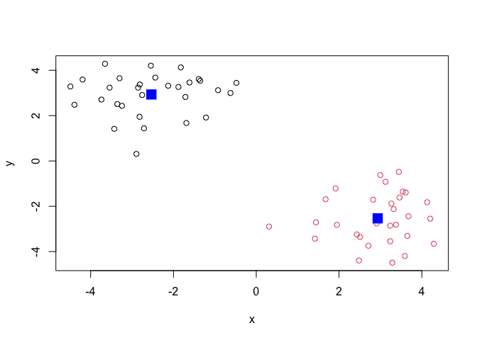
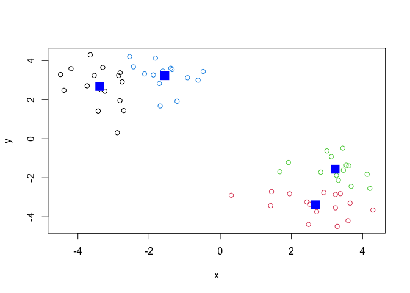
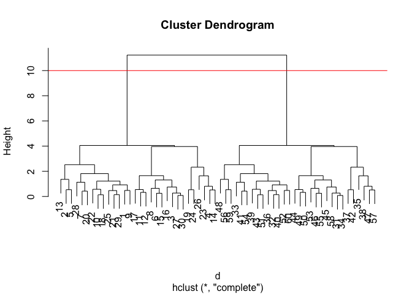
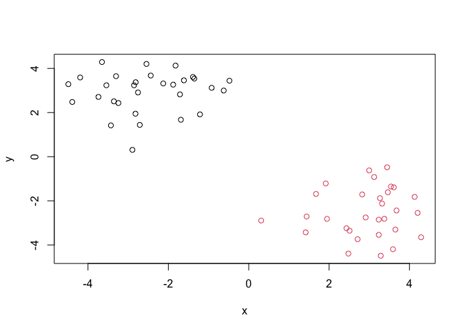
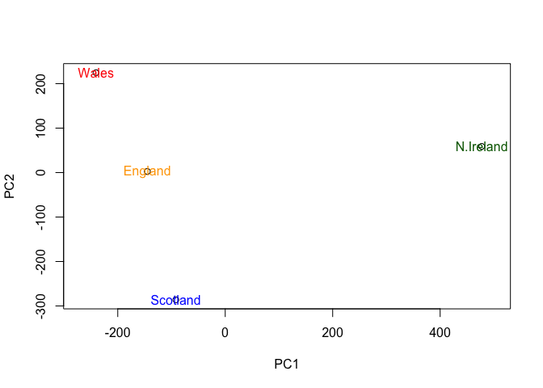

Class 7: Machine Learning 1
================
Siena Schumaker

In this class we will explore clustering and dimensionality reduction
methods.

## K-means number of clusters

Make up some input data where we know what the answer should be.

``` r
#`rnorm()` will generate random numbers around a specified number/ mean
rnorm(30, -3)
```

     [1] -1.7752331 -1.5211212 -1.8774151 -2.8107585 -3.7113455 -3.1201979
     [7] -2.6548920 -3.8796363 -3.8317105 -4.0478556 -3.5343553 -3.0142554
    [13] -4.1494815 -1.7122416 -3.5140798 -3.4203873 -3.7374776 -2.8819883
    [19] -3.3481027 -3.1021609 -2.7855072 -0.8433483 -4.1140812 -0.8952814
    [25] -4.3610913 -2.9398040 -4.4570371 -3.5598130 -2.9897065 -2.9889057

``` r
rnorm(30,3)
```

     [1] 3.379570 2.856706 3.091350 4.384623 3.778556 3.240887 2.154936 4.304746
     [9] 2.768879 2.132302 3.101291 2.532352 3.861501 3.077232 3.359163 3.444919
    [17] 2.380116 2.324705 3.933175 2.972550 4.660174 3.599468 4.235145 2.146521
    [25] 3.021740 1.719483 3.627512 3.828839 4.101874 3.079877

``` r
tmp <- c(rnorm(30,-3), rnorm(30,3))
#rev(tmp) will switch the positive 3s to be first in the vector and the -3s at the bottom
x <- cbind(x=tmp, y=rev(tmp))
```

Quick plot of x to see the two groups at -3,3 and 3,-3

``` r
plot(x)
```



use the `kmeans()` function setting k (centers) to 2 and nstart=20

``` r
km <- kmeans(x,centers=2, nstart=20)
km
```

    K-means clustering with 2 clusters of sizes 30, 30

    Cluster means:
              x         y
    1 -2.533095  2.933128
    2  2.933128 -2.533095

    Clustering vector:
     [1] 1 1 1 1 1 1 1 1 1 1 1 1 1 1 1 1 1 1 1 1 1 1 1 1 1 1 1 1 1 1 2 2 2 2 2 2 2 2
    [39] 2 2 2 2 2 2 2 2 2 2 2 2 2 2 2 2 2 2 2 2 2 2

    Within cluster sum of squares by cluster:
    [1] 59.30349 59.30349
     (between_SS / total_SS =  88.3 %)

    Available components:

    [1] "cluster"      "centers"      "totss"        "withinss"     "tot.withinss"
    [6] "betweenss"    "size"         "iter"         "ifault"      

> Q. How many points are in each cluster?

``` r
km$size
```

    [1] 30 30

> Q. What “component” of your result object details - cluster
> assignment/membership -cluster center?

``` r
km$cluster
```

     [1] 1 1 1 1 1 1 1 1 1 1 1 1 1 1 1 1 1 1 1 1 1 1 1 1 1 1 1 1 1 1 2 2 2 2 2 2 2 2
    [39] 2 2 2 2 2 2 2 2 2 2 2 2 2 2 2 2 2 2 2 2 2 2

``` r
km$centers
```

              x         y
    1 -2.533095  2.933128
    2  2.933128 -2.533095

> Q. Plot x colored by the kmeans cluster assignment and add cluster
> centers as blue points

``` r
plot(x, col=km$cluster)
#adds the cluster centers using points()
points(km$centers, col="blue", pch=15, cex=2)
```



Play with kmeans and ask for different number of clusters

``` r
km <- kmeans(x,centers=4, nstart=20)
plot(x, col=km$cluster)
points(km$centers, col="blue", pch=15, cex=2)
```



# Hierarchical clustering

This is another very useful and widely employed clustering method which
has the advantage over `kmeans` in that it can help reveal the something
of the true grouping in your data.

The `hclust()` function wants a distance matrix as input. We can get
thsi from the `dist()` function

``` r
d <- dist(x)
hc <- hclust(d)
hc
```


    Call:
    hclust(d = d)

    Cluster method   : complete 
    Distance         : euclidean 
    Number of objects: 60 

There is a plot method for hclust results:

``` r
plot(hc)
#adds a line to a dendrogram
abline(h=10, col="red")
```



To get my cluster membership vector, I need to “cut” my tree to yield
sub-trees or branches with all the members of a given cluster residing
on the same cut branch. The function to do this is called `cutree()`

``` r
#specifies a specific height (h) for cutree to cut
grps <- cutree(hc, h=10)
grps
```

     [1] 1 1 1 1 1 1 1 1 1 1 1 1 1 1 1 1 1 1 1 1 1 1 1 1 1 1 1 1 1 1 2 2 2 2 2 2 2 2
    [39] 2 2 2 2 2 2 2 2 2 2 2 2 2 2 2 2 2 2 2 2 2 2

``` r
plot(x, col=grps)
```



It is often helpful to use `k=` argument to cutree rather than the`h=`
height of cutting with `cutree()`. This will cut the tree to yield the
number of clustering you want.

``` r
#tells cutree where to cut to give me k number of clusters
cutree(hc, k=4)
```

     [1] 1 1 2 2 1 2 1 2 1 1 2 2 1 2 2 2 2 1 2 1 1 1 2 2 1 2 2 1 1 2 3 4 4 3 3 4 3 3
    [39] 4 4 4 3 4 3 3 3 3 4 3 3 4 4 3 4 3 4 3 3 4 4

# Principal Component Analysis (PCA)

The R function for PCA is called `prcomp()`

## PCA of UK food data

Import the data

``` r
url <- "https://tinyurl.com/UK-foods"
x <- read.csv(url)
```

# Checking your data

> Q1. How many rows and columns are in your new data frame named x? What
> R functions could you use to answer this questions?

Complete the following code to find out how many rows and columns are in
x?

``` r
dim(x)
```

    [1] 17  5

``` r
#has the right amount of rows and columns
```

Preview the first 6 rows

``` r
head(x,6)
```

                   X England Wales Scotland N.Ireland
    1         Cheese     105   103      103        66
    2  Carcass_meat      245   227      242       267
    3    Other_meat      685   803      750       586
    4           Fish     147   160      122        93
    5 Fats_and_oils      193   235      184       209
    6         Sugars     156   175      147       139

We need to fix it so row names is properly set and does not include
first column of our data set which is just numbers not the name of a
country.

``` r
rownames(x) <- x[,1]
x <- x[,-1]
head(x)
```

                   England Wales Scotland N.Ireland
    Cheese             105   103      103        66
    Carcass_meat       245   227      242       267
    Other_meat         685   803      750       586
    Fish               147   160      122        93
    Fats_and_oils      193   235      184       209
    Sugars             156   175      147       139

``` r
dim(x)
```

    [1] 17  4

``` r
#now number of columns is correct
```

There is another way to fix the row names issue:

``` r
x <- read.csv(url, row.names=1)
head(x)
```

                   England Wales Scotland N.Ireland
    Cheese             105   103      103        66
    Carcass_meat       245   227      242       267
    Other_meat         685   803      750       586
    Fish               147   160      122        93
    Fats_and_oils      193   235      184       209
    Sugars             156   175      147       139

> Q2. Which approach to solving the ‘row-names problem’ mentioned above
> do you prefer and why? Is one approach more robust than another under
> certain circumstances?

I prefer using the second method where we assign the row.names when we
read the csv file because I don’t need to create several objects to do
so like in the first method. Also, if you run the first method x
\<-x\[,-1\] several times, then it will continue to take away columns
every time you run it which makes it less ideal to use than the second
method.

# Spotting major differences and trends

> Q3: Changing what optional argument in the above barplot() function
> results in the following plot?

``` r
# this is the above barplot()
barplot(as.matrix(x), beside=T, col=rainbow(nrow(x)))
```


change the “beside” argument to be FALSE instead of TRUE so the bars
aren’t next to each other but rather stacked on top of each other.

``` r
barplot(as.matrix(x), beside=F, col=rainbow(nrow(x)))
```


> Q5: Generating all pairwise plots may help somewhat. Can you make
> sense of the following code and resulting figure? What does it mean if
> a given point lies on the diagonal for a given plot?

``` r
pairs(x, col=rainbow(nrow(x)), pch=16)
```


The figures show the different countries plotted against each other on
the x and y axis and shows two different graphs for each of the
countries plotted against another country with one graph being one
country on the x axis and in the next graph the countries switch axis
(ex: England vs Wales and Wales vs England). The graphs are symmetrical
based on the diagonal line. If a given point lies on the diagonal for a
given plot, it means those two countries have very similar consumption
for that particular food group.

> Q6. What is the main differences between N. Ireland and the other
> countries of the UK in terms of this data-set?

The main difference between Northern Ireland and the other countries in
the UK are fresh potatoes and fresh fruit as the dots don’t lie on the
diagonal when plotted against Northern Ireland. Alcoholic drinks are
another difference as it also doesn’t lie on the diagonal line.

# PCA

Use the `prcomp()` PCA function

``` r
pca <- prcomp( t(x) )
summary(pca)
```

    Importance of components:
                                PC1      PC2      PC3       PC4
    Standard deviation     324.1502 212.7478 73.87622 4.189e-14
    Proportion of Variance   0.6744   0.2905  0.03503 0.000e+00
    Cumulative Proportion    0.6744   0.9650  1.00000 1.000e+00

A “PCA plot” (a.k.a “Score plot”, PC1 vs PC2 plot, etc.)

``` r
pca$x
```

                     PC1         PC2         PC3           PC4
    England   -144.99315    2.532999 -105.768945  2.842865e-14
    Wales     -240.52915  224.646925   56.475555  7.804382e-13
    Scotland   -91.86934 -286.081786   44.415495 -9.614462e-13
    N.Ireland  477.39164   58.901862    4.877895  1.448078e-13

> Q7. Complete the code below to generate a plot of PC1 vs PC2. The
> second line adds text labels over the data points.

``` r
# Plot PC1 vs PC2
plot(pca$x[,1], pca$x[,2], xlab="PC1", ylab="PC2", xlim=c(-270,500))
text(pca$x[,1], pca$x[,2], colnames(x))
```


> Q8. Customize your plot so that the colors of the country names match
> the colors in our UK and Ireland map and table at start of this
> document.

``` r
plot(pca$x[,1], pca$x[,2], xlab="PC1", ylab="PC2", xlim=c(-270,500))
text(pca$x[,1], pca$x[,2], colnames(x), col=c("orange", "red", "blue", "darkgreen"), pch=15)
```



Calculate how much variation in the origincal data each PC accounts for

``` r
v <- round( pca$sdev^2/sum(pca$sdev^2) * 100 )
v
```

    [1] 67 29  4  0

``` r
#or for the second row
z <- summary(pca)
z$importance
```

                                 PC1       PC2      PC3          PC4
    Standard deviation     324.15019 212.74780 73.87622 4.188568e-14
    Proportion of Variance   0.67444   0.29052  0.03503 0.000000e+00
    Cumulative Proportion    0.67444   0.96497  1.00000 1.000000e+00

graph it in a bar graph

``` r
barplot(v, xlab="Principal Component", ylab="Percent Variation")
```


``` r
# Lets focus on PC1 as it accounts for > 90% of variance 
par(mar=c(10, 3, 0.35, 0))
barplot( pca$rotation[,1], las=2 )
```


> Q9: Generate a similar ‘loadings plot’ for PC2. What two food groups
> feature prominantely and what does PC2 maninly tell us about?

``` r
par(mar=c(10, 3, 0.35, 0))
barplot( pca$rotation[,2], las=2 )
```


Fresh potatoes are pushed to the positive side of the plot while soft
drinks are pushed to the negative side of the plot. PC2 mainly tells us
the second most variation in the data and that most of the variation
within this data set comes from fresh potatoes and soft drinks.
