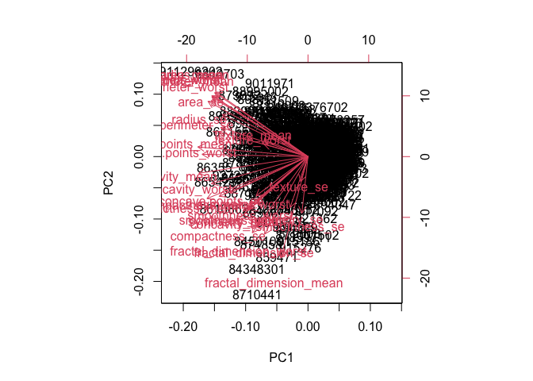

Class 8: Machine Learning Mini Project
================
Siena Schumaker

## Class 8: Mini Project

# Preparing the data

The data comes from the Wisconsin Breast Cancer Dosgnostic Data Set. You
need to download the file and put it in the same folder as this project
so you can access it.

``` r
# Save your input data file into your Project directory
fna.data <- "WisconsinCancer.csv"

# Complete the following code to input the data and store as wisc.df
wisc.df <- read.csv(fna.data, row.names=1)
```

Check that the column titles are correct

``` r
head(wisc.df, 5)
```

             diagnosis radius_mean texture_mean perimeter_mean area_mean
    842302           M       17.99        10.38         122.80    1001.0
    842517           M       20.57        17.77         132.90    1326.0
    84300903         M       19.69        21.25         130.00    1203.0
    84348301         M       11.42        20.38          77.58     386.1
    84358402         M       20.29        14.34         135.10    1297.0
             smoothness_mean compactness_mean concavity_mean concave.points_mean
    842302           0.11840          0.27760         0.3001             0.14710
    842517           0.08474          0.07864         0.0869             0.07017
    84300903         0.10960          0.15990         0.1974             0.12790
    84348301         0.14250          0.28390         0.2414             0.10520
    84358402         0.10030          0.13280         0.1980             0.10430
             symmetry_mean fractal_dimension_mean radius_se texture_se perimeter_se
    842302          0.2419                0.07871    1.0950     0.9053        8.589
    842517          0.1812                0.05667    0.5435     0.7339        3.398
    84300903        0.2069                0.05999    0.7456     0.7869        4.585
    84348301        0.2597                0.09744    0.4956     1.1560        3.445
    84358402        0.1809                0.05883    0.7572     0.7813        5.438
             area_se smoothness_se compactness_se concavity_se concave.points_se
    842302    153.40      0.006399        0.04904      0.05373           0.01587
    842517     74.08      0.005225        0.01308      0.01860           0.01340
    84300903   94.03      0.006150        0.04006      0.03832           0.02058
    84348301   27.23      0.009110        0.07458      0.05661           0.01867
    84358402   94.44      0.011490        0.02461      0.05688           0.01885
             symmetry_se fractal_dimension_se radius_worst texture_worst
    842302       0.03003             0.006193        25.38         17.33
    842517       0.01389             0.003532        24.99         23.41
    84300903     0.02250             0.004571        23.57         25.53
    84348301     0.05963             0.009208        14.91         26.50
    84358402     0.01756             0.005115        22.54         16.67
             perimeter_worst area_worst smoothness_worst compactness_worst
    842302            184.60     2019.0           0.1622            0.6656
    842517            158.80     1956.0           0.1238            0.1866
    84300903          152.50     1709.0           0.1444            0.4245
    84348301           98.87      567.7           0.2098            0.8663
    84358402          152.20     1575.0           0.1374            0.2050
             concavity_worst concave.points_worst symmetry_worst
    842302            0.7119               0.2654         0.4601
    842517            0.2416               0.1860         0.2750
    84300903          0.4504               0.2430         0.3613
    84348301          0.6869               0.2575         0.6638
    84358402          0.4000               0.1625         0.2364
             fractal_dimension_worst
    842302                   0.11890
    842517                   0.08902
    84300903                 0.08758
    84348301                 0.17300
    84358402                 0.07678

Remove the first column of the data set since it contains the answers we
are trying to find

``` r
# We can use -1 to remove the first column
wisc.data <- wisc.df[,-1]
```

Store the diagnosis data as a vector to check our work with later

``` r
# Create diagnosis vector for later 
diagnosis <- as.factor(wisc.df$diagnosis)
```

## Exploratory Data Analysis

> Q1. How many observations are in this dataset?

``` r
#the observations are the number of rows
nrow(wisc.df)
```

    [1] 569

> Q2. How many of the observations have a malignant diagnosis?

``` r
#use the table function to find which people have malignant diagnoses 
table(wisc.df$diagnosis)
```


      B   M 
    357 212 

> Q3. How many variables/features in the data are suffixed with \_mean?

First find the columnnames

``` r
colnames(wisc.df)
```

     [1] "diagnosis"               "radius_mean"            
     [3] "texture_mean"            "perimeter_mean"         
     [5] "area_mean"               "smoothness_mean"        
     [7] "compactness_mean"        "concavity_mean"         
     [9] "concave.points_mean"     "symmetry_mean"          
    [11] "fractal_dimension_mean"  "radius_se"              
    [13] "texture_se"              "perimeter_se"           
    [15] "area_se"                 "smoothness_se"          
    [17] "compactness_se"          "concavity_se"           
    [19] "concave.points_se"       "symmetry_se"            
    [21] "fractal_dimension_se"    "radius_worst"           
    [23] "texture_worst"           "perimeter_worst"        
    [25] "area_worst"              "smoothness_worst"       
    [27] "compactness_worst"       "concavity_worst"        
    [29] "concave.points_worst"    "symmetry_worst"         
    [31] "fractal_dimension_worst"

Next I need to search within the column names for “\_mean” pattern. The
`grep()` function might help here. Use `length()` to find the total
number of column names that have the pattern.

``` r
length(grep("_mean", colnames(wisc.df)))
```

    [1] 10

> Q. How many dimensions are there in this dataset?

``` r
ncol(wisc.df)
```

    [1] 31

``` r
dim(wisc.df)
```

    [1] 569  31

# Performing PCA

First do we need to scale the data before PCA or not

``` r
round(apply(wisc.data,2,sd),2)
```

                radius_mean            texture_mean          perimeter_mean 
                       3.52                    4.30                   24.30 
                  area_mean         smoothness_mean        compactness_mean 
                     351.91                    0.01                    0.05 
             concavity_mean     concave.points_mean           symmetry_mean 
                       0.08                    0.04                    0.03 
     fractal_dimension_mean               radius_se              texture_se 
                       0.01                    0.28                    0.55 
               perimeter_se                 area_se           smoothness_se 
                       2.02                   45.49                    0.00 
             compactness_se            concavity_se       concave.points_se 
                       0.02                    0.03                    0.01 
                symmetry_se    fractal_dimension_se            radius_worst 
                       0.01                    0.00                    4.83 
              texture_worst         perimeter_worst              area_worst 
                       6.15                   33.60                  569.36 
           smoothness_worst       compactness_worst         concavity_worst 
                       0.02                    0.16                    0.21 
       concave.points_worst          symmetry_worst fractal_dimension_worst 
                       0.07                    0.06                    0.02 

We need to scale the data

``` r
# Perform PCA on wisc.data by completing the following code
wisc.pr <- prcomp( wisc.data, scale=T )
```

``` r
# Look at summary of results
summary(wisc.pr)
```

    Importance of components:
                              PC1    PC2     PC3     PC4     PC5     PC6     PC7
    Standard deviation     3.6444 2.3857 1.67867 1.40735 1.28403 1.09880 0.82172
    Proportion of Variance 0.4427 0.1897 0.09393 0.06602 0.05496 0.04025 0.02251
    Cumulative Proportion  0.4427 0.6324 0.72636 0.79239 0.84734 0.88759 0.91010
                               PC8    PC9    PC10   PC11    PC12    PC13    PC14
    Standard deviation     0.69037 0.6457 0.59219 0.5421 0.51104 0.49128 0.39624
    Proportion of Variance 0.01589 0.0139 0.01169 0.0098 0.00871 0.00805 0.00523
    Cumulative Proportion  0.92598 0.9399 0.95157 0.9614 0.97007 0.97812 0.98335
                              PC15    PC16    PC17    PC18    PC19    PC20   PC21
    Standard deviation     0.30681 0.28260 0.24372 0.22939 0.22244 0.17652 0.1731
    Proportion of Variance 0.00314 0.00266 0.00198 0.00175 0.00165 0.00104 0.0010
    Cumulative Proportion  0.98649 0.98915 0.99113 0.99288 0.99453 0.99557 0.9966
                              PC22    PC23   PC24    PC25    PC26    PC27    PC28
    Standard deviation     0.16565 0.15602 0.1344 0.12442 0.09043 0.08307 0.03987
    Proportion of Variance 0.00091 0.00081 0.0006 0.00052 0.00027 0.00023 0.00005
    Cumulative Proportion  0.99749 0.99830 0.9989 0.99942 0.99969 0.99992 0.99997
                              PC29    PC30
    Standard deviation     0.02736 0.01153
    Proportion of Variance 0.00002 0.00000
    Cumulative Proportion  1.00000 1.00000

> Q4. From your results, what proportion of the original variance is
> captured by the first principal components (PC1)?

44.27%

> Q5. How many principal components (PCs) are required to describe at
> least 70% of the original variance in the data?

3 PCs capture 72%

> Q6. How many principal components (PCs) are required to describe at
> least 90% of the original variance in the data?

7 PCs are required to describe 91%

# Interpreting PCA results

create a plot

``` r
biplot(wisc.pr)
```



> Q7. What stands out to you about this plot? Is it easy or difficult to
> understand? Why?

This is a horrible plot that is incredibly hard to read/understand. You
can’t see where the labels are supposed to be or what they say. You
can’t interpret the graph easily.

``` r
# Scatter plot observations by components 1 and 2
plot(wisc.pr$x[,1], wisc.pr$x[,2], col = diagnosis, xlab = "PC1", ylab = "PC2")
```


> Q8. Generate a similar plot for principal components 1 and 3. What do
> you notice about these plots?

Repeat for components 1 and 3

``` r
plot(wisc.pr$x[, 1],wisc.pr$x[,3], col = diagnosis, 
     xlab = "PC1", ylab = "PC3")
```


The PC1 vs PC3 plot has more overlap betweeen the two groups than the
PC1 vs PC2 plot which has a larger separation of groups.

``` r
# Create a data.frame for ggplot
df <- as.data.frame(wisc.pr$x)
df$diagnosis <- diagnosis

# Load the ggplot2 package
library(ggplot2)

# Make a scatter plot colored by diagnosis
ggplot(df) + 
  aes(PC1, PC2, col=diagnosis) + 
  geom_point()
```


# Variance explained

We can get this from the output `summary()`function

``` r
summary(wisc.pr)
```

    Importance of components:
                              PC1    PC2     PC3     PC4     PC5     PC6     PC7
    Standard deviation     3.6444 2.3857 1.67867 1.40735 1.28403 1.09880 0.82172
    Proportion of Variance 0.4427 0.1897 0.09393 0.06602 0.05496 0.04025 0.02251
    Cumulative Proportion  0.4427 0.6324 0.72636 0.79239 0.84734 0.88759 0.91010
                               PC8    PC9    PC10   PC11    PC12    PC13    PC14
    Standard deviation     0.69037 0.6457 0.59219 0.5421 0.51104 0.49128 0.39624
    Proportion of Variance 0.01589 0.0139 0.01169 0.0098 0.00871 0.00805 0.00523
    Cumulative Proportion  0.92598 0.9399 0.95157 0.9614 0.97007 0.97812 0.98335
                              PC15    PC16    PC17    PC18    PC19    PC20   PC21
    Standard deviation     0.30681 0.28260 0.24372 0.22939 0.22244 0.17652 0.1731
    Proportion of Variance 0.00314 0.00266 0.00198 0.00175 0.00165 0.00104 0.0010
    Cumulative Proportion  0.98649 0.98915 0.99113 0.99288 0.99453 0.99557 0.9966
                              PC22    PC23   PC24    PC25    PC26    PC27    PC28
    Standard deviation     0.16565 0.15602 0.1344 0.12442 0.09043 0.08307 0.03987
    Proportion of Variance 0.00091 0.00081 0.0006 0.00052 0.00027 0.00023 0.00005
    Cumulative Proportion  0.99749 0.99830 0.9989 0.99942 0.99969 0.99992 0.99997
                              PC29    PC30
    Standard deviation     0.02736 0.01153
    Proportion of Variance 0.00002 0.00000
    Cumulative Proportion  1.00000 1.00000

Calculate variance of each component

``` r
pr.var <- wisc.pr$sdev^2
head(pr.var)
```

    [1] 13.281608  5.691355  2.817949  1.980640  1.648731  1.207357

Variance explained by each principal component: pve’

``` r
pve <- pr.var/sum(pr.var)
pve
```

     [1] 4.427203e-01 1.897118e-01 9.393163e-02 6.602135e-02 5.495768e-02
     [6] 4.024522e-02 2.250734e-02 1.588724e-02 1.389649e-02 1.168978e-02
    [11] 9.797190e-03 8.705379e-03 8.045250e-03 5.233657e-03 3.137832e-03
    [16] 2.662093e-03 1.979968e-03 1.753959e-03 1.649253e-03 1.038647e-03
    [21] 9.990965e-04 9.146468e-04 8.113613e-04 6.018336e-04 5.160424e-04
    [26] 2.725880e-04 2.300155e-04 5.297793e-05 2.496010e-05 4.434827e-06

Plot variance explained for each principal component

``` r
plot(pve, xlab = "Principal Component", 
     ylab = "Proportion of Variance Explained", 
   type = "o")
```


Alternative scree plot of the same data, note data driven y-axis.
PLotted as a bar plot.

``` r
barplot(pve, ylab = "Precent of Variance Explained",
     names.arg=paste0("PC",1:length(pve)), las=2, axes = FALSE)
axis(2, at=pve, labels=round(pve,2)*100 )
```


# Examine the PC loading

How much do the original values contribute to the new PCs that we have
calculated? To get at this data we can look at`$rotation component` of
the returned PCA object

``` r
head(wisc.pr$rotation[,1:3])
```

                            PC1         PC2          PC3
    radius_mean      -0.2189024  0.23385713 -0.008531243
    texture_mean     -0.1037246  0.05970609  0.064549903
    perimeter_mean   -0.2275373  0.21518136 -0.009314220
    area_mean        -0.2209950  0.23107671  0.028699526
    smoothness_mean  -0.1425897 -0.18611302 -0.104291904
    compactness_mean -0.2392854 -0.15189161 -0.074091571

> Q9. For the first principal component, what is the component of the
> loading vector (i.e. wisc.pr\$rotation\[,1\]) for the feature
> concave.points_mean?

``` r
wisc.pr$rotation["concave.points_mean",1]
```

    [1] -0.2608538

There is a complicated mix of variables that go together to make up PC1-
i.e. there are many of the original variables that together contribute
highly to PC1.

``` r
loadings <- as.data.frame(wisc.pr$rotation)

ggplot(loadings)+aes(PC1, rownames(loadings))+geom_col()
```


> Q10. What is the minimum number of principal components required to
> explain 80% of the variance of the data?

5 PCs

# Hierarchal Clustering

Scale the wisc.data data using the “scale()” function

``` r
data.scaled <- scale(wisc.data)
```

Calculate the (Euclidean) distances between all pairs of observations in
the new scaled dataset and assign the result to data.dist.

``` r
data.dist <- dist(data.scaled)
```

Create a hierarchical clustering model using complete linkage. Manually
specify the method argument to `hclust()` and assign the results to
wisc.hclust.

``` r
wisc.hclust <- hclust(data.dist)
```

> Q11. Using the plot() and abline() functions, what is the height at
> which the clustering model has 4 clusters?

at a height of 19

``` r
plot(wisc.hclust)
```


Cut this tree to yield cluster membership vector with `cutree()`
function

``` r
grps <- cutree(wisc.hclust,h=19)
table(grps)
```

    grps
      1   2   3   4 
    177   7 383   2 

``` r
table(grps,diagnosis)
```

        diagnosis
    grps   B   M
       1  12 165
       2   2   5
       3 343  40
       4   0   2

> Q12. Can you find a better cluster vs diagnoses match by cutting into
> a different number of clusters between 2 and 10?

``` r
group <- cutree(wisc.hclust, k=10)
table(group, diagnosis)
```

         diagnosis
    group   B   M
       1   12  86
       2    0  59
       3    0   3
       4  331  39
       5    0  20
       6    2   0
       7   12   0
       8    0   2
       9    0   2
       10   0   1

By cutting it into more groups instead of four (groups \> 4), you get a
better cluster vs diagnosis match as the groups become more defined with
mostly one type of diagnosis per group. The less groups you have, the
more there are both types of diagnoses in one group. More clusters
allows hierarchal clustering to separate the diagnoses better.

# combine methods: PCA and HCLUST

My PCA results were interesting as they showed a separation of M and B
samples along PC1.

``` r
plot(wisc.pr$x[,1], wisc.pr$x[,2], col=diagnosis)
```


I want to cluster my PCA results- that is use `wisc.pr$x` as input to
`hclust()`.

TRY CLUSTERING 3 PCS, that is PC1, PC2, and PC3 as input

``` r
d <- dist(wisc.pr$x[,1:3])

wisc.pr.hclust <- hclust(d, method="ward.D2")
```

> Q13. Which method gives your favorite results for the same data.dist
> dataset? Explain your reasoning.

My favorite method is the ward.D2 method because the clusters look more
even than when using single (was was very difficult to see the
clusters), complete, or average. I feel it is a better way to display
the data and clearly shows where the clusters are.

As my tree result figure

``` r
plot(wisc.pr.hclust)
abline(h=19, col="red", lty=2)
```


Let’s cut this tree into two groups/clusters

``` r
grps <- cutree(wisc.pr.hclust, k=2)
table(grps)
```

    grps
      1   2 
    203 366 

``` r
plot(wisc.pr$x[,1], wisc.pr$x[,2], col=grps)
```


How well do the two clusters separate the M and B diagnosis?

``` r
table(grps, diagnosis)
```

        diagnosis
    grps   B   M
       1  24 179
       2 333  33

``` r
(179+333)/nrow(wisc.data)
```

    [1] 0.8998243

> Q15. How well does the newly created model with four clusters separate
> out the two diagnoses?

``` r
grps <- cutree(wisc.pr.hclust, k=4)

table(grps, diagnosis)
```

        diagnosis
    grps   B   M
       1   0 111
       2  24  68
       3 184  32
       4 149   1

``` r
(111+68+184+149)/nrow(wisc.data)
```

    [1] 0.8998243

The model with four clusters is just as accurate as the model with two
clusters (89.9% accuracy) which still isn’t particularly accurate.
