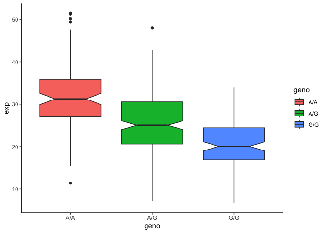

Class 11: Genome Informatics
================
Siena Schumaker

## Population Scale Analysis

One sample is obviously not enough to know what is happening in a
population. You are interested in assessing genetic differences on a
population scale. So, you processed about \~230 samples and did the
normalization on a genome level. Now, you want to find whether there is
any association of the 4 asthma-associated SNPs (rs8067378…) on ORMDL3
expression.

> Q1: Read this file into R and determine the sample size for each
> genotype and their corresponding median expression levels for each of
> these genotypes. Hint: The read.table(), summary() and boxplot()
> functions will likely be useful here. There is an example R script
> online to be used ONLY if you are struggling in vein. Note that you
> can find the medium value from saving the output of the boxplot()
> function to an R object and examining this object. There is also the
> medium() and summary() function that you can use to check your
> understanding.

Read the data

``` r
expr <- read.table("rs8067378_ENSG00000172057.6.txt")

head(expr)
```

       sample geno      exp
    1 HG00367  A/G 28.96038
    2 NA20768  A/G 20.24449
    3 HG00361  A/A 31.32628
    4 HG00135  A/A 34.11169
    5 NA18870  G/G 18.25141
    6 NA11993  A/A 32.89721

How many samples do we have?

``` r
nrow(expr)
```

    [1] 462

The sample size is 462 individuals.

``` r
table(expr$geno)
```


    A/A A/G G/G 
    108 233 121 

``` r
test <- split(expr, f=expr$geno)

median(test$`A/A`$exp)
```

    [1] 31.24847

``` r
median(test$`A/G`$exp)
```

    [1] 25.06486

``` r
median(test$`G/G`$exp)
```

    [1] 20.07363

The median expression of the A/A genotype is 31.25. The median
expression for the A/G genotype is 25.06. The median expression for the
G/G genotype is 20.07.

``` r
library(ggplot2)
```

> Q2: Generate a boxplot with a box per genotype, what could you infer
> from the relative expression value between A/A and G/G displayed in
> this plot? Does the SNP effect the expression of ORMDL3? Hint: An
> example boxplot is provided overleaf – yours does not need to be as
> polished as this one.

Let’s make a boxplot

``` r
boxplot <- ggplot(expr, aes(geno, exp, fill=geno))+geom_boxplot(notch=T)+theme_classic()
boxplot
```



By plotting the relative expression values for the different genotypes,
it is evident that the expression levels between A/A and G/G are very
different with A/A having a larger expression value than G/G. The SNP
does affect the expression of ORMDL3 as seen by the box plot and how A/A
has a different expression level than G/G.
