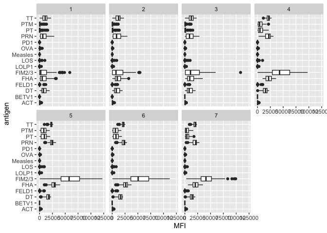
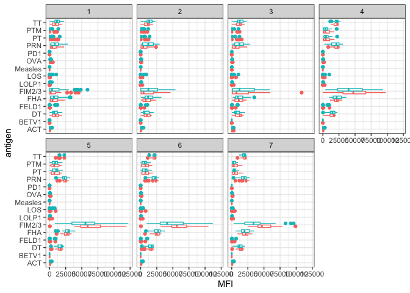
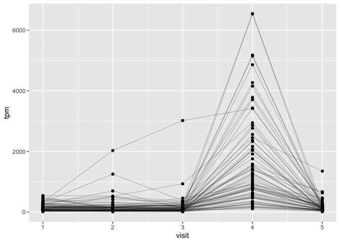

Class_19:Investigating_Pertussis_Resurgence
================

## Investigating Pertussis Resurgence

# Investigating pertussis cases by year

The CDC tracks cases of Pertussis in the US. We can get their data via
web-scrapping.

``` r
cdc
```

       Year  Cases
    1  1922 107473
    2  1923 164191
    3  1924 165418
    4  1925 152003
    5  1926 202210
    6  1927 181411
    7  1928 161799
    8  1929 197371
    9  1930 166914
    10 1931 172559
    11 1932 215343
    12 1933 179135
    13 1934 265269
    14 1935 180518
    15 1936 147237
    16 1937 214652
    17 1938 227319
    18 1939 103188
    19 1940 183866
    20 1941 222202
    21 1942 191383
    22 1943 191890
    23 1944 109873
    24 1945 133792
    25 1946 109860
    26 1947 156517
    27 1948  74715
    28 1949  69479
    29 1950 120718
    30 1951  68687
    31 1952  45030
    32 1953  37129
    33 1954  60886
    34 1955  62786
    35 1956  31732
    36 1957  28295
    37 1958  32148
    38 1959  40005
    39 1960  14809
    40 1961  11468
    41 1962  17749
    42 1963  17135
    43 1964  13005
    44 1965   6799
    45 1966   7717
    46 1967   9718
    47 1968   4810
    48 1969   3285
    49 1970   4249
    50 1971   3036
    51 1972   3287
    52 1973   1759
    53 1974   2402
    54 1975   1738
    55 1976   1010
    56 1977   2177
    57 1978   2063
    58 1979   1623
    59 1980   1730
    60 1981   1248
    61 1982   1895
    62 1983   2463
    63 1984   2276
    64 1985   3589
    65 1986   4195
    66 1987   2823
    67 1988   3450
    68 1989   4157
    69 1990   4570
    70 1991   2719
    71 1992   4083
    72 1993   6586
    73 1994   4617
    74 1995   5137
    75 1996   7796
    76 1997   6564
    77 1998   7405
    78 1999   7298
    79 2000   7867
    80 2001   7580
    81 2002   9771
    82 2003  11647
    83 2004  25827
    84 2005  25616
    85 2006  15632
    86 2007  10454
    87 2008  13278
    88 2009  16858
    89 2010  27550
    90 2011  18719
    91 2012  48277
    92 2013  28639
    93 2014  32971
    94 2015  20762
    95 2016  17972
    96 2017  18975
    97 2018  15609
    98 2019  18617

Make a plot with a trendline

``` r
library("ggplot2")
library(scales)
```

> Q1. With the help of the R “addin” package datapasta assign the CDC
> pertussis case number data to a data frame called cdc and use ggplot
> to make a plot of cases numbers over time.

``` r
baseplot <- ggplot(cdc, aes(Year, Cases))+
  geom_point()+
  geom_line()+
  labs(title="Cases of Pertussis in US from 1920 to 2019", subtitle="Data from the CDC")+
  scale_y_continuous(labels = label_comma())
```

``` r
baseplot
```


> Q2. Using the ggplot geom_vline() function add lines to your previous
> plot for the 1946 introduction of the wP vaccine and the 1996 switch
> to aP vaccine (see example in the hint below). What do you notice?

``` r
baseplot+
  geom_vline(xintercept=1946, col="blue")+
  geom_vline(xintercept=1996, col="red")+
  geom_text(aes(x=1944,y=255000,label="wP"))+
  geom_text(aes(x=1994, y=255000, label="aP"))
```


> Q3. Describe what happened after the introduction of the aP vaccine?
> Do you have a possible explanation for the observed trend?

When the wP vaccine was introduced, case numbers went down since people
were getting the vaccine and it was very effective. When the aP vaccine
was introduced, the number of cases remained low for a while but began
to rise and is on an upward trend. This could be due to a few different
reasons such as people being more skeptical to get vaccines due to
misinformation or that the aP vaccine isn’t as effective as the wP
vaccine over a long period of time since cases were low for a while and
then began to spike. It could also be that the bacteria evolved and
gained some immunity to the vaccine which would explain the later spike
in cases.

# The CMI-PB Project

The CMI=PB project is collecting data on aP and wP individuals and their
immune response to infection and/or booster shots.

CMI-PB returns data from it’s API and JSON format (like most APIs). We
will use the jsonlite package to get data from this API.

``` r
library(jsonlite)

subject <- read_json("https://www.cmi-pb.org/api/subject", simplifyVector =T)

head(subject)
```

      subject_id infancy_vac biological_sex              ethnicity  race
    1          1          wP         Female Not Hispanic or Latino White
    2          2          wP         Female Not Hispanic or Latino White
    3          3          wP         Female                Unknown White
    4          4          wP           Male Not Hispanic or Latino Asian
    5          5          wP           Male Not Hispanic or Latino Asian
    6          6          wP         Female Not Hispanic or Latino White
      year_of_birth date_of_boost      dataset
    1    1986-01-01    2016-09-12 2020_dataset
    2    1968-01-01    2019-01-28 2020_dataset
    3    1983-01-01    2016-10-10 2020_dataset
    4    1988-01-01    2016-08-29 2020_dataset
    5    1991-01-01    2016-08-29 2020_dataset
    6    1988-01-01    2016-10-10 2020_dataset

> Q4. How may aP and wP infancy vaccinated subjects are in the dataset?

``` r
table(subject$infancy_vac)
```


    aP wP 
    47 49 

> Q5. How many Male and Female subjects/patients are in the dataset?

``` r
table(subject$biological_sex)
```


    Female   Male 
        66     30 

> Q6. What is the breakdown of race and biological sex (e.g. number of
> Asian females, White males etc…)?

``` r
table(subject$race, subject$biological_sex)
```

                                               
                                                Female Male
      American Indian/Alaska Native                  0    1
      Asian                                         18    9
      Black or African American                      2    0
      More Than One Race                             8    2
      Native Hawaiian or Other Pacific Islander      1    1
      Unknown or Not Reported                       10    4
      White                                         27   13

``` r
library(lubridate)
```


    Attaching package: 'lubridate'

    The following objects are masked from 'package:base':

        date, intersect, setdiff, union

``` r
today()
```

    [1] "2023-03-19"

> Q7. Using this approach determine (i) the average age of wP
> individuals, (ii) the average age of aP individuals; and (iii) are
> they significantly different?

``` r
age_days <- today() - ymd(subject$year_of_birth)
age_years <- time_length(age_days,"years")
subject$age <-age_years
```

Now find the average age of all individuals:

``` r
mean(subject$age)
```

    [1] 31.06448

Now use splyr to subset to wP or aP subjects

> 1)  average age of wP individuals

``` r
library(dplyr)
```


    Attaching package: 'dplyr'

    The following objects are masked from 'package:stats':

        filter, lag

    The following objects are masked from 'package:base':

        intersect, setdiff, setequal, union

``` r
ap.age <- filter(subject, infancy_vac =="wP")$age
mean(ap.age)
```

    [1] 36.37374

> 2)  average age of aP individuals

``` r
wp.age <- filter(subject, infancy_vac =="aP")$age
mean(wp.age)
```

    [1] 25.52929

> 3)  are they significantly different?

``` r
t.test(ap.age, wp.age)
```


        Welch Two Sample t-test

    data:  ap.age and wp.age
    t = 12.092, df = 51.082, p-value < 2.2e-16
    alternative hypothesis: true difference in means is not equal to 0
    95 percent confidence interval:
      9.044045 12.644857
    sample estimates:
    mean of x mean of y 
     36.37374  25.52929 

T-test tells us that the data is significantly different.

> Q8. Determine the age of all individuals at time of boost?

``` r
int <- ymd(subject$date_of_boost) - ymd(subject$year_of_birth)
age_at_boost <- time_length(int, "year")
head(age_at_boost)
```

    [1] 30.69678 51.07461 33.77413 28.65982 25.65914 28.77481

> Q9. With the help of a faceted boxplot (see below), do you think these
> two groups are significantly different?

``` r
ggplot(subject) +
  aes(time_length(age, "year"),
      fill=as.factor(infancy_vac)) +
  geom_histogram(show.legend=FALSE) +
  facet_wrap(vars(infancy_vac), nrow=2) 
```

    `stat_bin()` using `bins = 30`. Pick better value with `binwidth`.


Yes they are significantly different, if they were similar their graphs
would look much more similar.

# Joining multiple tables

Read the specimen and ab_titer tables into R and store the data as
specimen and titer named data frames.

``` r
specimen <- read_json("https://www.cmi-pb.org/api/specimen", simplifyVector = T)

titer <- read_json("https://www.cmi-pb.org/api/ab_titer", simplifyVector = T)
```

``` r
head(specimen)
```

      specimen_id subject_id actual_day_relative_to_boost
    1           1          1                           -3
    2           2          1                          736
    3           3          1                            1
    4           4          1                            3
    5           5          1                            7
    6           6          1                           11
      planned_day_relative_to_boost specimen_type visit
    1                             0         Blood     1
    2                           736         Blood    10
    3                             1         Blood     2
    4                             3         Blood     3
    5                             7         Blood     4
    6                            14         Blood     5

``` r
head(titer)
```

      specimen_id isotype is_antigen_specific antigen        MFI MFI_normalised
    1           1     IgE               FALSE   Total 1110.21154       2.493425
    2           1     IgE               FALSE   Total 2708.91616       2.493425
    3           1     IgG                TRUE      PT   68.56614       3.736992
    4           1     IgG                TRUE     PRN  332.12718       2.602350
    5           1     IgG                TRUE     FHA 1887.12263      34.050956
    6           1     IgE                TRUE     ACT    0.10000       1.000000
       unit lower_limit_of_detection
    1 UG/ML                 2.096133
    2 IU/ML                29.170000
    3 IU/ML                 0.530000
    4 IU/ML                 6.205949
    5 IU/ML                 4.679535
    6 IU/ML                 2.816431

To know whether a given specimen_id comes from an aP or wP individual we
need to link (a.k.a. “join” or merge) our specimen and subject data
frames. The excellent dplyr package (that we have used previously) has a
family of join() functions that can help us with this common task:

> Q9. Complete the code to join specimen and subject tables to make a
> new merged data frame containing all specimen records along with their
> associated subject details:

``` r
meta <- inner_join(specimen, subject)
```

    Joining with `by = join_by(subject_id)`

``` r
dim(meta)
```

    [1] 729  14

``` r
head(meta)
```

      specimen_id subject_id actual_day_relative_to_boost
    1           1          1                           -3
    2           2          1                          736
    3           3          1                            1
    4           4          1                            3
    5           5          1                            7
    6           6          1                           11
      planned_day_relative_to_boost specimen_type visit infancy_vac biological_sex
    1                             0         Blood     1          wP         Female
    2                           736         Blood    10          wP         Female
    3                             1         Blood     2          wP         Female
    4                             3         Blood     3          wP         Female
    5                             7         Blood     4          wP         Female
    6                            14         Blood     5          wP         Female
                   ethnicity  race year_of_birth date_of_boost      dataset
    1 Not Hispanic or Latino White    1986-01-01    2016-09-12 2020_dataset
    2 Not Hispanic or Latino White    1986-01-01    2016-09-12 2020_dataset
    3 Not Hispanic or Latino White    1986-01-01    2016-09-12 2020_dataset
    4 Not Hispanic or Latino White    1986-01-01    2016-09-12 2020_dataset
    5 Not Hispanic or Latino White    1986-01-01    2016-09-12 2020_dataset
    6 Not Hispanic or Latino White    1986-01-01    2016-09-12 2020_dataset
           age
    1 37.21013
    2 37.21013
    3 37.21013
    4 37.21013
    5 37.21013
    6 37.21013

> Q10. Now using the same procedure join meta with titer data so we can
> further analyze this data in terms of time of visit aP/wP, male/female
> etc.

``` r
abdata <- inner_join(titer, meta)
```

    Joining with `by = join_by(specimen_id)`

``` r
dim(abdata)
```

    [1] 32675    21

``` r
head(abdata,4)
```

      specimen_id isotype is_antigen_specific antigen        MFI MFI_normalised
    1           1     IgE               FALSE   Total 1110.21154       2.493425
    2           1     IgE               FALSE   Total 2708.91616       2.493425
    3           1     IgG                TRUE      PT   68.56614       3.736992
    4           1     IgG                TRUE     PRN  332.12718       2.602350
       unit lower_limit_of_detection subject_id actual_day_relative_to_boost
    1 UG/ML                 2.096133          1                           -3
    2 IU/ML                29.170000          1                           -3
    3 IU/ML                 0.530000          1                           -3
    4 IU/ML                 6.205949          1                           -3
      planned_day_relative_to_boost specimen_type visit infancy_vac biological_sex
    1                             0         Blood     1          wP         Female
    2                             0         Blood     1          wP         Female
    3                             0         Blood     1          wP         Female
    4                             0         Blood     1          wP         Female
                   ethnicity  race year_of_birth date_of_boost      dataset
    1 Not Hispanic or Latino White    1986-01-01    2016-09-12 2020_dataset
    2 Not Hispanic or Latino White    1986-01-01    2016-09-12 2020_dataset
    3 Not Hispanic or Latino White    1986-01-01    2016-09-12 2020_dataset
    4 Not Hispanic or Latino White    1986-01-01    2016-09-12 2020_dataset
           age
    1 37.21013
    2 37.21013
    3 37.21013
    4 37.21013

> Q11. How many specimens (i.e. entries in abdata) do we have for each
> isotype?

``` r
table(abdata$isotype)
```


     IgE  IgG IgG1 IgG2 IgG3 IgG4 
    6698 1413 6141 6141 6141 6141 

> Q12. What do you notice about the number of visit 8 specimens compared
> to other visits?

``` r
table(abdata$visit)
```


       1    2    3    4    5    6    7    8 
    5795 4640 4640 4640 4640 4320 3920   80 

The number of specimens for 8 visits is significantly lower than the
other number of visits. The reason visit 8 is so small is because the
project is still ongoing so the data hasn’t fully been collected for
visit 8 yet.

# Examine IgG1 Ab titer levels

Exclude visit 8 from the analysis

``` r
ig1 <- abdata %>% filter(isotype == "IgG1", visit!=8)
head(ig1)
```

      specimen_id isotype is_antigen_specific antigen        MFI MFI_normalised
    1           1    IgG1                TRUE     ACT 274.355068      0.6928058
    2           1    IgG1                TRUE     LOS  10.974026      2.1645083
    3           1    IgG1                TRUE   FELD1   1.448796      0.8080941
    4           1    IgG1                TRUE   BETV1   0.100000      1.0000000
    5           1    IgG1                TRUE   LOLP1   0.100000      1.0000000
    6           1    IgG1                TRUE Measles  36.277417      1.6638332
       unit lower_limit_of_detection subject_id actual_day_relative_to_boost
    1 IU/ML                 3.848750          1                           -3
    2 IU/ML                 4.357917          1                           -3
    3 IU/ML                 2.699944          1                           -3
    4 IU/ML                 1.734784          1                           -3
    5 IU/ML                 2.550606          1                           -3
    6 IU/ML                 4.438966          1                           -3
      planned_day_relative_to_boost specimen_type visit infancy_vac biological_sex
    1                             0         Blood     1          wP         Female
    2                             0         Blood     1          wP         Female
    3                             0         Blood     1          wP         Female
    4                             0         Blood     1          wP         Female
    5                             0         Blood     1          wP         Female
    6                             0         Blood     1          wP         Female
                   ethnicity  race year_of_birth date_of_boost      dataset
    1 Not Hispanic or Latino White    1986-01-01    2016-09-12 2020_dataset
    2 Not Hispanic or Latino White    1986-01-01    2016-09-12 2020_dataset
    3 Not Hispanic or Latino White    1986-01-01    2016-09-12 2020_dataset
    4 Not Hispanic or Latino White    1986-01-01    2016-09-12 2020_dataset
    5 Not Hispanic or Latino White    1986-01-01    2016-09-12 2020_dataset
    6 Not Hispanic or Latino White    1986-01-01    2016-09-12 2020_dataset
           age
    1 37.21013
    2 37.21013
    3 37.21013
    4 37.21013
    5 37.21013
    6 37.21013

> Q13. Complete the following code to make a summary boxplot of Ab titer
> levels for all antigens:

``` r
ggplot(ig1) +
  aes(MFI, antigen) +
  geom_boxplot() + 
  facet_wrap(vars(visit), nrow=2)
```



> Q14. What antigens show differences in the level of IgG1 antibody
> titers recognizing them over time? Why these and not others?

FIM 2/3 (fimbrial protein), FHA (filamentous hemagglutinin), and PRN
(pertactin autotransporter). These are rising because they’re part of
the aP boost vaccine and the immune system is recognizing them. DT also
increases as it is one of the antibodies respondign to the bacteria.

We can attempt to examine differences between wP and aP here by setting
color and/or facet values of the plot to include infancy_vac status (see
below). However these plots tend to be rather busy and thus hard to
interpret easily.

``` r
ggplot(ig1) +
  aes(MFI, antigen, col=infancy_vac ) +
  geom_boxplot(show.legend = FALSE) + 
  facet_wrap(vars(visit), nrow=2) +
  theme_bw()
```



``` r
ggplot(ig1) +
  aes(MFI, antigen, col=infancy_vac ) +
  geom_boxplot(show.legend = FALSE) + 
  facet_wrap(vars(infancy_vac, visit), nrow=2)
```


> Q15. Filter to pull out only two specific antigens for analysis and
> create a boxplot for each. You can chose any you like. Below I picked
> a “control” antigen (“Measles”, that is not in our vaccines) and a
> clear antigen of interest (“FIM2/3”, extra-cellular fimbriae proteins
> from B. pertussis that participate in substrate attachment).

``` r
filter(ig1, antigen=="TT") %>%
  ggplot() +
  aes(MFI, col=infancy_vac) +
  geom_boxplot(show.legend = F) +
  facet_wrap(vars(visit)) +
  theme_bw()
```


``` r
filter(ig1, antigen=="FIM2/3") %>%
  ggplot() +
  aes(MFI, col=infancy_vac) +
  geom_boxplot(show.legend = T) +
  facet_wrap(vars(visit)) +
  theme_bw()
```


``` r
filter(ig1, antigen=="PRN") %>%
  ggplot() +
  aes(MFI, col=infancy_vac) +
  geom_boxplot(show.legend = T) +
  facet_wrap(vars(visit)) +
  theme_bw()
```


> Q16. What do you notice about these two antigens time course and the
> FIM2/3 data in particular?

The TT antigen doesn’t increase much over the time course and stays
pretty consistent the whole time. For the FIM2/3 data, the boxplot is
increasing over the time course and ends at a much higher MFI than the
TT. The FIM2/3 peaks around visit 5 and 6 and then starts to decline a
bit.

> Q17. Do you see any clear difference in aP vs. wP responses?

Looking at FIM2/3 and PRN which we saw earlier is involved with the
vaccine, the aP response seems to be greater than the wP responses by
visit 3 or 4 and then continues to increase at a greater rate than wP
and then both the aP and wP vaccine begin to decline around visit 6 or
7.

# Obtaining CMI-PB RNASeq data

The link is for the key gene involved in expressing any IgG1 antibody,
namely the IGHG1 gene. Let’s read available RNA-Seq data for this gene
into R and investigate the time course of it’s gene expression values.

``` r
url <- "https://www.cmi-pb.org/api/v2/rnaseq?versioned_ensembl_gene_id=eq.ENSG00000211896.7"

rna <- read_json(url, simplifyVector = TRUE) 
```

``` r
head(rna)
```

      versioned_ensembl_gene_id specimen_id raw_count      tpm
    1         ENSG00000211896.7         344     18613  929.640
    2         ENSG00000211896.7         243      2011  112.584
    3         ENSG00000211896.7         261      2161  124.759
    4         ENSG00000211896.7         282      2428  138.292
    5         ENSG00000211896.7         345     51963 2946.136
    6         ENSG00000211896.7         244     49652 2356.749

To facilitate further analysis we need to “join” the rna expression data
with our metadata meta, which is itself a join of sample and specimen
data. This will allow us to look at this genes TPM expression values
over aP/wP status and at different visits (i.e. times):

``` r
#meta <- inner_join(specimen, subject)
ssrna <- inner_join(rna, meta)
```

    Joining with `by = join_by(specimen_id)`

> Q18. Make a plot of the time course of gene expression for IGHG1 gene
> (i.e. a plot of visit vs. tpm).

``` r
ggplot(ssrna) +
  aes(visit, tpm, group=subject_id) +
  geom_point() +
  geom_line(alpha=0.2)
```



Focus in on visit 4 and facet by aP/wP subjects

``` r
ssrna %>%  
  filter(visit==4) %>% 
  ggplot() +
    aes(tpm, col=infancy_vac) + geom_density() + 
    geom_rug() 
```


> Q19.: What do you notice about the expression of this gene (i.e. when
> is it at it’s maximum level)?

The expression of this gene reaches its maximum level at visit 4 and
then immediately drops back down to 0 by visit 5.

> Q20. Does this pattern in time match the trend of antibody titer data?
> If not, why not?

This pattern in time does not match the trend of antibody titer data
because this pattern has the maximum level being reached at visit 4
whereas the trend of antibody titer data seems to reach the maximum
level around visit 5 and 6. Also, this pattern has the levels going from
0 visit 3 to max at visit 4 and then back to 0 by visit 5. With the
antibody titer data, the change among visits was much more gradual.
