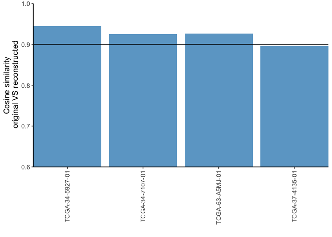

Class 18: Cancer Mini Project
================
Siena Schumaker

## Mutation Signatures in Human Cancer: Lung squamous cell carcinomas

\#Exploring a cancer sequencing data portal

> Q. How many cancer samples are included in the dataset?

487 samples

> Q. Which is the most mutated gene?

TP53

> Q. Which is the most common treatment undergone by patients?

Cisplatin

Looking at the data, there is a clear bias towards European ancestry
patients. This is because most of the studies have been done in the
western world. To try and combat these biases, reserachers are getting
samples from across the world and they found that people from different
locations have different types of cancers (this is due to a few
different factors such as genetics and environmental factors)

# Generating mutational matrices and visualizing mutational profiles

``` r
if (!require("BiocManager")){
    install.packages("BiocManager")
}
```

    Loading required package: BiocManager

``` r
if (!require("maftools")){
    BiocManager::install("maftools")
}
```

    Loading required package: maftools

``` r
if (!require("BSgenome.Hsapiens.UCSC.hg19")){         # reference genome needed to
BiocManager::install("BSgenome.Hsapiens.UCSC.hg19")   # generate mutational matrices
}
```

    Loading required package: BSgenome.Hsapiens.UCSC.hg19

    Loading required package: BSgenome

    Loading required package: BiocGenerics


    Attaching package: 'BiocGenerics'

    The following objects are masked from 'package:stats':

        IQR, mad, sd, var, xtabs

    The following objects are masked from 'package:base':

        anyDuplicated, aperm, append, as.data.frame, basename, cbind,
        colnames, dirname, do.call, duplicated, eval, evalq, Filter, Find,
        get, grep, grepl, intersect, is.unsorted, lapply, Map, mapply,
        match, mget, order, paste, pmax, pmax.int, pmin, pmin.int,
        Position, rank, rbind, Reduce, rownames, sapply, setdiff, sort,
        table, tapply, union, unique, unsplit, which.max, which.min

    Loading required package: S4Vectors

    Loading required package: stats4


    Attaching package: 'S4Vectors'

    The following objects are masked from 'package:base':

        expand.grid, I, unname

    Loading required package: IRanges

    Loading required package: GenomeInfoDb

    Loading required package: GenomicRanges

    Loading required package: Biostrings

    Loading required package: XVector


    Attaching package: 'Biostrings'

    The following object is masked from 'package:base':

        strsplit

    Loading required package: rtracklayer

``` r
# Read maf file
library(maftools)
```

``` r
coad = read.maf('lusc_tcga_pan_can_atlas_2018/data_mutations.txt')
```

    -Reading
    Avoidable 1.314 seconds. This file is very unusual: it ends abruptly without a final newline, and also its size is a multiple of 4096 bytes. Please properly end the last row with a newline using for example 'echo >> file' to avoid this  time to copy.
    -Validating
    --Removed 9003 duplicated variants
    -Silent variants: 30325 
    -Summarizing
    --Possible FLAGS among top ten genes:
      TTN
      MUC16
      USH2A
      SYNE1
    -Processing clinical data
    --Missing clinical data
    -Finished in 9.552s elapsed (7.835s cpu) 

``` r
# Generate mutational matrix (SBS96 context)
mm_coad = trinucleotideMatrix(maf = coad, prefix = 'chr', add = TRUE,
                              ref_genome = "BSgenome.Hsapiens.UCSC.hg19")
```

    -Extracting 5' and 3' adjacent bases
    -Extracting +/- 20bp around mutated bases for background C>T estimation
    -Estimating APOBEC enrichment scores
    --Performing one-way Fisher's test for APOBEC enrichment
    ---APOBEC related mutations are enriched in  30.483 % of samples (APOBEC enrichment score > 2 ;  82  of  269  samples)
    -Creating mutation matrix
    --matrix of dimension 269x96

``` r
mm_coad = t(mm_coad$nmf_matrix)
```

``` r
mm_coad[1:5, 1:5]
```

            TCGA-18-3406-01 TCGA-18-3407-01 TCGA-18-3408-01 TCGA-18-3410-01
    A[C>A]A               1               2               2               8
    A[C>A]C               5               0               3               1
    A[C>A]G               4               2               1               1
    A[C>A]T               1               1               0               1
    C[C>A]A              33              86              10              70
            TCGA-18-3411-01
    A[C>A]A               5
    A[C>A]C               5
    A[C>A]G               4
    A[C>A]T               8
    C[C>A]A              48

``` r
# Install MutationalPatterns package
if (!require("MutationalPatterns")){
BiocManager::install("MutationalPatterns")
}
```

    Loading required package: MutationalPatterns

    Loading required package: NMF

    Loading required package: registry

    Loading required package: rngtools

    Loading required package: cluster

    NMF - BioConductor layer [OK] | Shared memory capabilities [NO: bigmemory] | Cores 7/8

      To enable shared memory capabilities, try: install.extras('
    NMF
    ')


    Attaching package: 'NMF'

    The following object is masked from 'package:S4Vectors':

        nrun

``` r
# Generate mutational profiles (4 random samples)
library(MutationalPatterns)
set.seed(11111) # fixing the seed for random number generation
```

``` r
samples_to_plot = sample(1:ncol(mm_coad),4) # selecting 4 random samples
plot_96_profile(mm_coad[,samples_to_plot], condensed = T)
```


``` r
# Generate mutational profiles- top 4 mutated samples
mutations_in_samples = colSums(mm_coad)
mutations_in_samples = sort(mutations_in_samples, decreasing = T)
samples_to_plot = names(mutations_in_samples)[1:4]
plot_96_profile(mm_coad[,samples_to_plot], condensed = T)
```


``` r
# and top 4 less mutated
mutations_in_samples = sort(mutations_in_samples, decreasing = F)
samples_to_plot = names(mutations_in_samples)[1:4]
plot_96_profile(mm_coad[,samples_to_plot], condensed = T)
```


``` r
# Generate average mutational profiles
relative_mutational_profile = apply(mm_coad, 2, prop.table) # obtained relative
                                                            # mutational matrix
average_mutational_profile = rowMeans(relative_mutational_profile)
average_mutational_profile = data.frame(average_mutational_profile)
plot_96_profile(average_mutational_profile, condensed = T)
```


# Assigning reference mutational signatures

``` r
# Mutational signature assignment
cosmic_signatures = get_known_signatures(source = 'COSMIC_v3.2')
fit_res = fit_to_signatures(mm_coad, cosmic_signatures)

# Top contributing signatures
contributions = fit_res$contribution

top_contributing_signatures_abs = rowMeans(contributions)
top_contributing_signatures_abs = sort(top_contributing_signatures_abs,
                                       decreasing = T)[1:4]

## Top 4 contributing signatures (absolute values)
top_contributing_signatures_abs
```

         SBS4     SBS24     SBS39     SBS13 
    110.13893  29.25962  25.99316  24.00456 

``` r
relative_contributions = apply(contributions,2,prop.table)
top_contributing_signatures_rel = rowMeans(relative_contributions)
top_contributing_signatures_rel = sort(top_contributing_signatures_rel,
                                       decreasing = T)[1:4]

## Top 4 contributing signatures (relative values)
top_contributing_signatures_rel
```

          SBS4      SBS24      SBS39      SBS13 
    0.24757272 0.08060154 0.07426198 0.06571420 

# Visualizing mutational signature assignment results

``` r
# Visualization of signature assignment results (fit_to_signatures)
set.seed(11111)
samples_to_plot = sample(1:ncol(mm_coad),4)

plot_contribution(contributions[,samples_to_plot], mode = "absolute")
```


``` r
plot_contribution(contributions[,samples_to_plot], mode = "relative")
```


``` r
plot_contribution_heatmap(contributions, cluster_samples = F)
```


``` r
# Cosine similarity reconstruction vs. original mutational profile (fit_to_signatures)
set.seed(11111)
samples_to_plot = sample(1:ncol(mm_coad),4)

plot_original_vs_reconstructed(mm_coad[,samples_to_plot],
                               fit_res$reconstructed[,samples_to_plot], 
                               y_intercept = 0.90)
```


# Extra: Using the strict version for the analysis

``` r
# Mutational signature assignment strict
fit_res_strict = fit_to_signatures_strict(mm_coad, cosmic_signatures)
fit_res_strict = fit_res_strict$fit_res
contributions_strict = fit_res_strict$contribution
```

``` r
# Visualization of signature assignment results (strict)
plot_contribution(contributions_strict[,samples_to_plot], mode = "absolute")
```


``` r
plot_contribution(contributions_strict[,samples_to_plot], mode = "relative")
```


``` r
plot_contribution_heatmap(contributions_strict, cluster_samples = F)
```


``` r
# Cosine similarity reconstruction vs. original mutational profile (strict)
plot_original_vs_reconstructed(mm_coad[,samples_to_plot],
                               fit_res_strict$reconstructed[,samples_to_plot], 
                               y_intercept = 0.90)
```



> Q. Which is the etiology of the top absolute contributing signature
> for liver cancer?

aristolochic acid exposure

> Q. Which is the most prominent mutational context for the top
> contributing signature in skin cancer?

C \> T

> Q. The etiology of the top contributing signature for lung cancer
> corresponds to an endogenous cellular mechanism.

False; the top contributor is SBS4 which is associated with tobacco
smoking which is not associated with a endogenous cellular mechanism

> Q. SBS4 is one of the most common signatures found in lung cancer and
> is associated with tobacco smoking.

True

> Q. SBS7d is one of the most common signatures in skin cancer and is
> associated with UV light exposure and high numbers of C\>T mutations.

False; it is associated with T \> C mutations.
