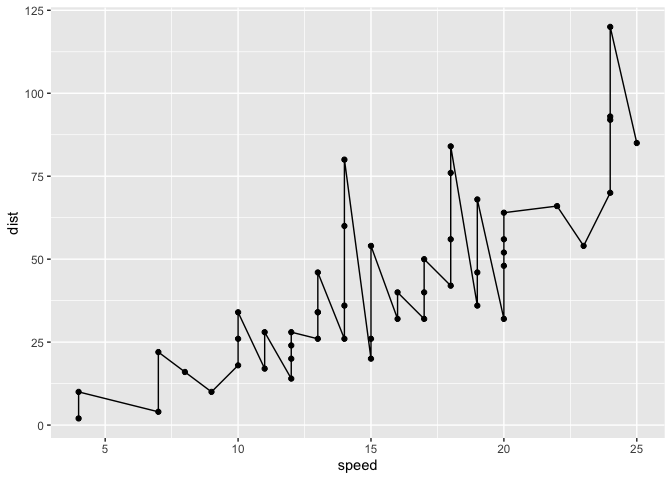
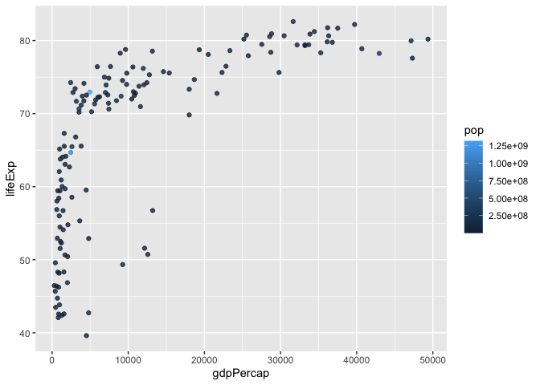

Class 5: Data Visualization
================
Siena Schumaker

# Plotting in R

R has multiple plotting and graphics systems. The most popular of which
is **ggplot2**.

We have already played with “base” R graphics. This comes along with R
“out of the box”.

``` r
plot(cars)
```


Compared to base R plots ggplot is much more verbose- I need to write
more code to get simple plots like the above.

To use ggplot, I need to first install the ggplot2 package. To install
any package in R, I use `install.packages()` command along with package
name

The install is a one time only requirement. The package is now on our
computer. I don’t need to re-install it.

However, I can’t just use it without loading it up with a `library()`
call.

``` r
library(ggplot2)
```

``` r
ggplot(cars)
```


All ggplot figures need at least three things:

-data (this is the data.frame with our numbers) -aesthetics (“aes”, how
our data maps to the plot) -geoms (do you want lines, points, columns,
ect….)

``` r
ggplot(data=cars)+ 
  aes(x=speed, y=dist)+
  geom_point()
```


I want a trend line to show the relationship between speed and stopping
distance

``` r
ggplot(data=cars)+ 
  aes(x=speed, y=dist)+geom_point()+
  geom_line()
```



That is not what we want

``` r
ggplot(data=cars)+ 
  aes(x=speed, y=dist)+
  geom_point()+
  geom_smooth()
```

    `geom_smooth()` using method = 'loess' and formula = 'y ~ x'


For a linear model

``` r
ggplot(data=cars)+ 
  aes(x=speed, y=dist)+
  geom_point()+
  geom_smooth(method="lm", se=F)
```

    `geom_smooth()` using formula = 'y ~ x'


# Section 6: Genes

``` r
url <- "https://bioboot.github.io/bimm143_S20/class-material/up_down_expression.txt"
genes <- read.delim(url)
head(genes,5)
```

       Gene Condition1 Condition2      State
    1 A4GNT -3.6808610 -3.4401355 unchanging
    2  AAAS  4.5479580  4.3864126 unchanging
    3 AASDH  3.7190695  3.4787276 unchanging
    4  AATF  5.0784720  5.0151916 unchanging
    5  AATK  0.4711421  0.5598642 unchanging

``` r
tail(genes, 5)
```

            Gene Condition1 Condition2      State
    5192 ZSCAN30   3.872021   4.152321 unchanging
    5193    ZW10   5.398920   5.225200 unchanging
    5194    ZXDA   3.278497   3.380043 unchanging
    5195  ZYG11B   6.140027   6.108686 unchanging
    5196     ZYX   4.122194   4.159777 unchanging

``` r
nrow(genes)
```

    [1] 5196

``` r
colnames(genes)
```

    [1] "Gene"       "Condition1" "Condition2" "State"     

``` r
ncol(genes)
```

    [1] 4

``` r
x <- table (genes[,"State"])
x
```


          down unchanging         up 
            72       4997        127 

``` r
round(x/nrow(genes) *100, 2)
```


          down unchanging         up 
          1.39      96.17       2.44 

``` r
ggplot(genes) + 
    aes(x=Condition1, y=Condition2, col=State) +
    geom_point()+
  labs(title="Gene Expresion Changes Upon Drug Treatment", x="Control (no drug)", y="Drug Treatment")+
  scale_color_manual(values=c("purple", "skyblue", "orange"))
```


# Section 7: Gapminder

``` r
url <- "https://raw.githubusercontent.com/jennybc/gapminder/master/inst/extdata/gapminder.tsv"

gapminder <- read.delim(url)
```

``` r
library(dplyr)
```


    Attaching package: 'dplyr'

    The following objects are masked from 'package:stats':

        filter, lag

    The following objects are masked from 'package:base':

        intersect, setdiff, setequal, union

``` r
gapminder_2007 <- gapminder %>% filter(year==2007)

mind <- ggplot(gapminder_2007)+aes(x=gdpPercap, y=lifeExp)
mind+aes(col=continent, size=pop)+geom_point(alpha=0.5)
```


``` r
mind+aes(col=pop)+geom_point(alpha=0.8)
```



``` r
mind+aes(size=pop)+
  geom_point(alpha=0.5)+
  scale_size_area(max_size=10)
```


``` r
gapminder_1957 <- gapminder %>% filter(year==1957)
```

``` r
ggplot(gapminder_1957)+
  aes(x=gdpPercap, y=lifeExp, col=continent, size=pop)+
  geom_point(alpha=0.7)+
  scale_size_area(max_size=15)
```


``` r
gapmindercombo <- gapminder %>% filter (year==1957|year==2007)

ggplot(gapmindercombo)+
  aes(x=gdpPercap, y=lifeExp, col=continent, size=pop)+
  geom_point(alpha=0.7)+
  scale_size_area(max_size=10)+
  facet_wrap(~year)
```


